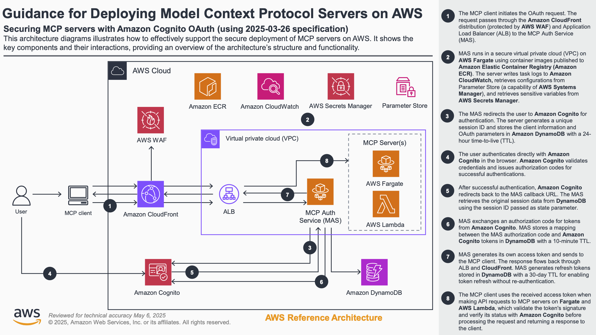

# Guidance for Deploying Model Context Protocol Servers on AWS

## Table of Contents

1. [Overview](#overview)
   - [Cost](#cost)
2. [Prerequisites](#prerequisites)
   - [Operating System](#operating-system)
3. [Deployment Steps](#deployment-steps)
4. [Deployment Validation](#deployment-validation)
5. [Running the Guidance](#running-the-guidance)
6. [Next Steps](#next-steps)
7. [Cleanup](#cleanup)
8. [FAQ, known issues, additional considerations, and limitations](#faq-known-issues-additional-considerations-and-limitations)
9. [Revisions](#revisions)
10. [Notices](#notices)

## Overview

This guidance demonstrates how to deploy Model Context Protocol (MCP) servers on AWS with secure authentication using Amazon Cognito. It enables you to host MCP servers that can be accessed remotely while maintaining security through OAuth 2.0 authentication flows.

The solution addresses several key challenges:

- Secure hosting of MCP servers on AWS infrastructure
- Authentication and authorization using AWS Cognito
- Remote access to MCP servers through secure endpoints
- Scalable and maintainable deployment using AWS CDK

### Architecture



The architecture implements:

1. CloudFront distribution for global content delivery
2. Application Load Balancer for traffic distribution
3. ECS Fargate for containerized MCP servers
4. AWS Cognito for user authentication
5. AWS WAF for security
6. DynamoDB for token storage

### Cost

You are responsible for the cost of the AWS services used while running this Guidance. As of May 2025, the cost for running this Guidance with the default settings in the US East (N. Virginia) Region is approximately $189.97 per month for processing moderate traffic levels.

We recommend creating a [Budget](https://docs.aws.amazon.com/cost-management/latest/userguide/budgets-managing-costs.html) through [AWS Cost Explorer](https://aws.amazon.com/aws-cost-management/aws-cost-explorer/) to help manage costs. Prices are subject to change. For full details, refer to the pricing webpage for each AWS service used in this Guidance.

#### Estimated Cost Table

The following table provides a sample cost breakdown for deploying this Guidance with the default parameters in the US East (N. Virginia) Region for one month.

| AWS service            | Dimensions                                         | Cost [USD]        |
| ---------------------- | -------------------------------------------------- | ----------------- |
| VPC (NAT Gateway)      | 1 NAT Gateway × 730 hours + 100 GB data processing | $32.85            |
| Elastic Load Balancing | Application Load Balancer with moderate traffic    | $18.62            |
| Amazon Cognito         | 10,500 MAUs (500 above free tier)                  | $7.50             |
| CloudFront             | 2 TB data transfer + 15M requests                  | $85.00            |
| WAF                    | 2 Web ACLs (CloudFront and Regional)               | $10.00            |
| DynamoDB               | Token storage with on-demand capacity              | $5.40             |
| ECS (Fargate)          | 1 vCPU, 2GB memory × 730 hours                     | $30.00            |
| Secrets Manager        | 1 secret for Cognito credentials                   | $0.40             |
| Lambda                 | Custom resources (minimal usage)                   | $0.20             |
| **Total**              |                                                    | **$189.97/month** |

## Prerequisites

### Operating System

These deployment instructions are optimized to work on **Amazon Linux 2 AMI**. Deployment in another OS may require additional steps.

### Required Tools

1. [AWS CLI](https://aws.amazon.com/cli/) installed and configured
2. [Node.js](https://nodejs.org/) v14 or later
3. [AWS CDK](https://aws.amazon.com/cdk/) installed:
   ```bash
   npm install -g aws-cdk
   ```

### AWS Account Requirements

1. AWS account with administrative access
2. Enabled services:
   - Amazon Cognito
   - Amazon ECS
   - AWS CloudFront
   - Amazon DynamoDB
   - AWS WAF
   - AWS Secrets Manager

### AWS CDK Bootstrap

If you're using AWS CDK for the first time, bootstrap your account:

```bash
cdk bootstrap
```

## Deployment Steps

1. Clone the repository:

   ```bash
   git clone <repository-url>
   cd guidance-for-remote-mcp-servers-on-aws
   cd source
   ```

2. Install dependencies:

   ```bash
   npm install
   ```

3. Deploy the stacks:

   ```bash
   cdk deploy --all
   ```

4. (Optional) Configure custom domain:
   ```bash
   cdk deploy --all --context certificateArn=arn:aws:acm:... --context customDomain=mcp-server.example.com
   ```

## Deployment Validation

1. Verify CloudFormation stack status:

   - Open AWS CloudFormation console
   - Check that all stacks show "CREATE_COMPLETE"

2. Validate Cognito setup:

   - Open Amazon Cognito console
   - Verify User Pool creation
   - Confirm App Client configuration

3. Verify infrastructure:
   - CloudFront distribution is "Deployed"
   - Application Load Balancer is "Active"
   - ECS services are running

## Running the Guidance

### Testing with mcp-remote


The [`mcp-remote`](https://www.npmjs.com/package/mcp-remote) utility enables MCP clients that only support local (stdio) servers to connect to remote MCP servers with authentication support. While this tool is considered experimental, it provides a crucial bridge for testing and development.

### Why mcp-remote?

Most MCP servers are currently installed locally using stdio transport, which offers benefits like implicit trust between client and server, secure handling of API keys via environment variables, and simplified installation through tools like `npx` and `uvx`.

However, web-based deployment offers significant advantages for development and maintenance:

- Easier bug fixing and feature iteration through centralized updates
- No need to run code on users' machines
- Simplified distribution and version management

While the MCP Authorization specification now provides a secure way to share MCP servers remotely, many popular MCP clients are still stdio-only or lack support for OAuth flows. The `mcp-remote` utility bridges this gap until clients implement native support for remote, authorized servers.

1. Install mcp-remote:

   ```bash
   npm install -g mcp-remote
   ```

2. Create configuration (e.g., `config.json`):

   ```json
   {
     "mcpServers": {
       "weather-sse-python": {
         "command": "npx",
         "args": [
           "mcp-remote@latest",
           "https://<your-cloudfront-endpoint>/weather-python/sse"
         ]
       },
       "weather-streamable-nodejs": {
         "command": "npx",
         "args": [
           "mcp-remote@latest",
           "https://<your-cloudfront-endpoint>/weather-nodejs/mcp"
         ]
       },
       "weather-streamable-nodejs-lambda": {
         "command": "npx",
         "args": [
           "mcp-remote@latest",
           "https://<your-cloudfront-endpoint>/weather-nodejs-lambda/mcp"
         ]
       }
     }
   }
   ```

3. Test the connection:
   ```bash
   npx mcp-remote@latest https://<your-cloudfront-endpoint>/weather-python/sse
   ```

## Next Steps

1. Implement additional MCP servers:

   - Add new server containers to ECS
   - Configure OAuth flows for new servers
   - Update mcp-remote configuration

2. Optimize costs:

   - Monitor usage patterns
   - Consider reserved capacity for steady workloads
   - Implement caching strategies

3. Enhance security:
   - Enable MFA in Cognito
   - Implement additional WAF rules
   - Set up monitoring and alerting

## Cleanup

1. Remove deployed resources:

   ```bash
   cdk destroy --all
   ```

2. Manual cleanup steps:
   - Empty any created S3 buckets
   - Delete Cognito User Pool (if not needed)
   - Remove CloudWatch log groups
   - Delete any created secrets in Secrets Manager

## FAQ, known issues, additional considerations, and limitations

### Known Issues

1. Token refresh may require re-authentication in some cases
2. CloudFront cache invalidation may take up to 5 minutes
3. Initial cold start delay for Fargate containers

### Additional Considerations

- Public endpoints are created for OAuth flows
- CloudFront distributions may take 15-20 minutes to deploy
- DynamoDB tables use on-demand capacity by default

For detailed information, refer to these additional documentation files:

- [Monthly Cost Estimate Report](assets/cost-estimate-report.md)
- [Basic OAuth Flow](assets/mcp-cognito-oauth-flow.md)
- [Detailed OAuth Flow](assets/detailed-mcp-cognito-oauth-flow.md)
- [AWS Architecture](assets/aws-cognito-mcp-integration.md)
- [Token Binding & Validation](assets/token-binding-validation-flow.md)

### Limitations

1. Region availability depends on AWS Cognito support
2. Custom domains require ACM certificates in us-east-1
3. Some MCP clients may not support remote connections

For any feedback, questions, or suggestions, please use the issues tab under this repo.

## Revisions

### [1.0.0] - 2025-05-06

- Initial release
- Basic OAuth flow implementation
- Support for weather sample servers

## Notices

Customers are responsible for making their own independent assessment of the information in this Guidance. This Guidance: (a) is for informational purposes only, (b) represents AWS current product offerings and practices, which are subject to change without notice, and (c) does not create any commitments or assurances from AWS and its affiliates, suppliers or licensors. AWS products or services are provided "as is" without warranties, representations, or conditions of any kind, whether express or implied. AWS responsibilities and liabilities to its customers are controlled by AWS agreements, and this Guidance is not part of, nor does it modify, any agreement between AWS and its customers.
